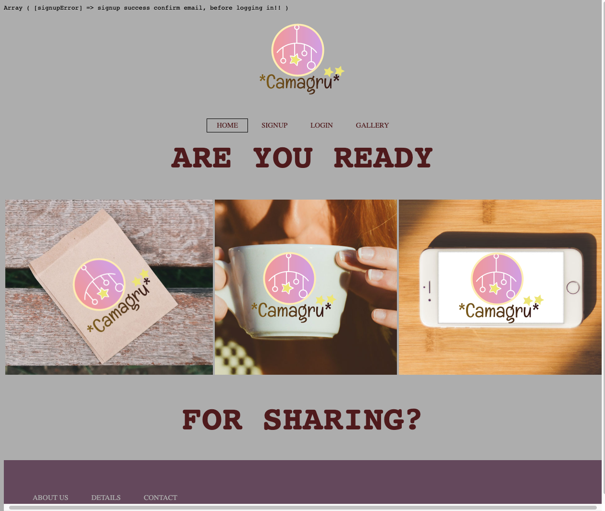
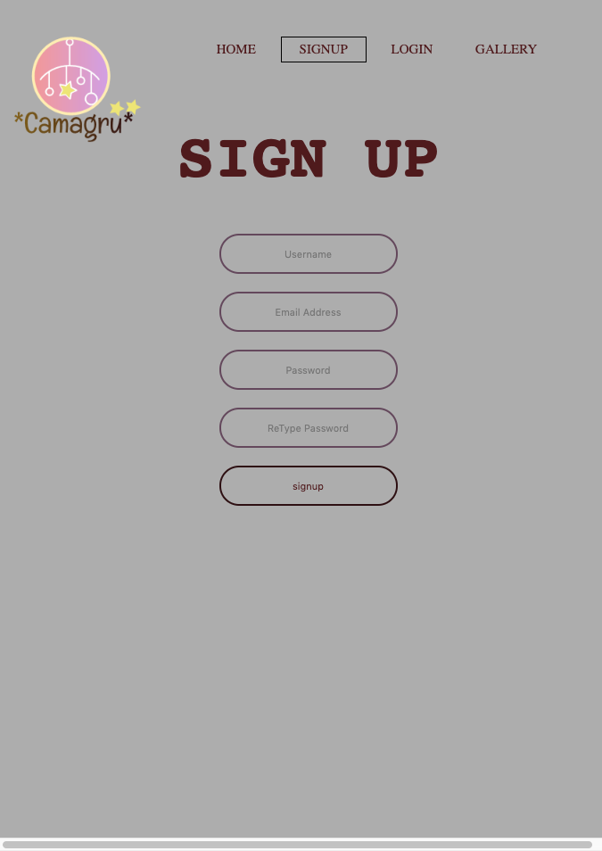

# Camagru

Camagru is an Instagram-like website. It allows you to take pictures with your webcam or upload one, and add beautiful filters on it.

It is the first Web Project of WeThinkCode_

### Installation

```
Go to :

camagru/config/setup.php

```

## Built With

* [Bootstap](https://www.w3schools.com/cssref/) -  a free and open-source CSS framework directed at responsive, mobile-first front-end web development. It contains CSS- and JavaScript-based design templates for typography, forms, buttons, navigation and other interface components.
* [Html & Css](https://www.w3schools.com/cssref/) - CSS stands for Cascading Style Sheets. CSS describes how HTML elements are to be displayed on screen, paper, or in other media. 
* [Javascript](https://devdocs.io/javascript/) - a high-level, interpreted scripting language that conforms to the ECMAScript specification
* [PHP](https://www.php.net/docs.php) - Hypertext Preprocessor is a general-purpose programming language originally designed for web development.

## Authors

* **Polite Sambo** - *Student @* - [WeThinkCode_](https://github.com/PollySambo)

# Website overview

## Home Page



## Sign Up Page



## Gallery Page

.png)